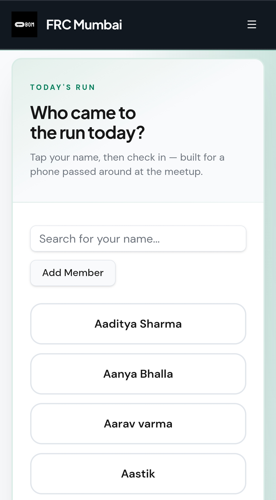
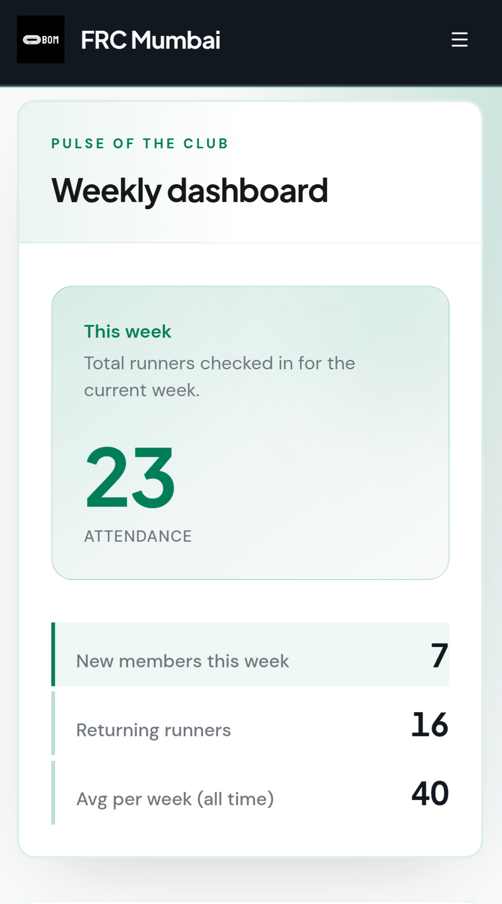
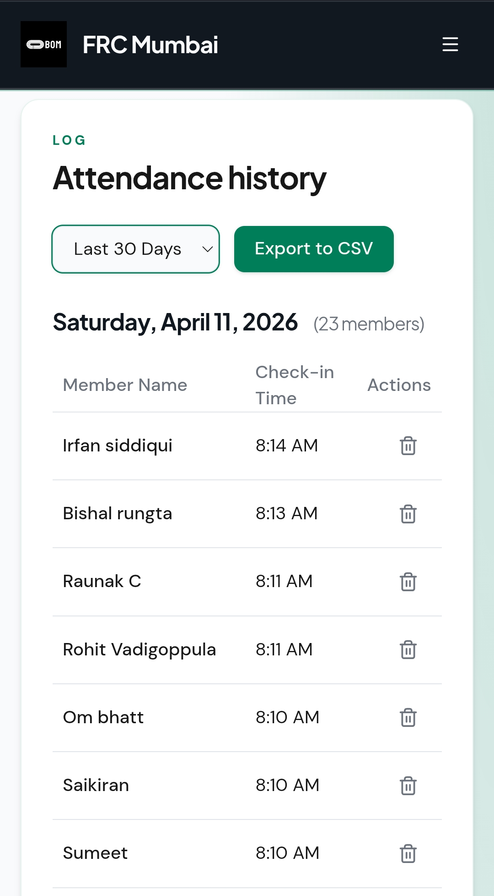
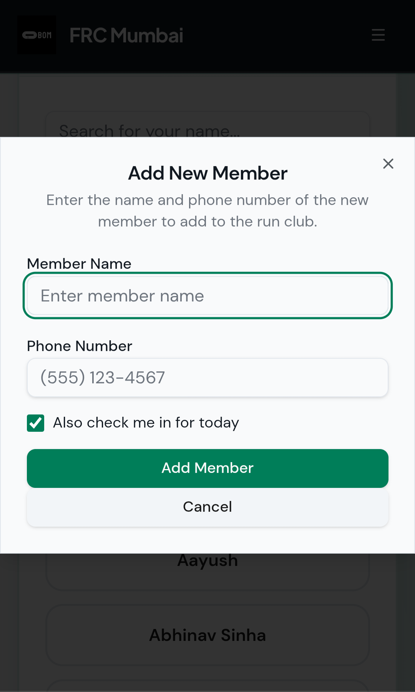

# FRC Attendance Tracker

A mobile-friendly web app for tracking weekly run club attendance. Built for FRC (Founders Run Club) chapters and other running groups who want a simple, shareable attendance system—pass a single phone around before or after the run and let members check themselves in.

**Originally built for FRC Mumbai.** Fork this repo to spin up your own chapter's attendance app.

## Screenshots

| Check-In | Dashboard |
|----------|-----------|
|  |  |

| History | Add Member |
|---------|------------|
|  |  |

## Features

- **Quick Check-In** – Members select their name from a searchable list and tap to check in
- **Weekly Dashboard** – Track total attendance, new members, and returning members per week
- **Member Management** – Add and remove members, view total runs and last attendance
- **Attendance History** – Browse past records with filters (today, last 30 days, all time)
- **CSV Export** – Download attendance data for analysis or reporting
- **Authentication** – Firebase Auth protects admin features (members, history, dashboard)

## Tech Stack

| Layer | Technology |
|-------|------------|
| Framework | React 18 + Vite |
| Styling | Tailwind CSS v4, shadcn/ui |
| Database | Firebase Firestore |
| Auth | Firebase Authentication |
| Routing | React Router v6 |
| Date handling | date-fns |

## Prerequisites

- **Node.js** 18+ (recommend 20+)
- **npm** or **pnpm**
- A **Firebase** project (free tier works)

## Quick Start

```bash
# Clone the repo
git clone https://github.com/your-org/frc-attendance.git
cd frc-attendance

# Install dependencies
npm install

# Configure Firebase (see below)
# Edit src/firebase.js with your project's config

# Run locally
npm run dev
```

Open `http://localhost:5173` in your browser.

## Setup Guide

### 1. Create a Firebase Project

Each chapter should use its own Firebase project so data stays separate.

1. Go to [Firebase Console](https://console.firebase.google.com/)
2. Create a new project (e.g. `frc-your-chapter-attendance`)
3. Enable **Firestore Database**:
   - Firestore Database → Create database
   - Start in **test mode** for development
   - Pick a region close to your users

4. Enable **Authentication**:
   - Authentication → Get started
   - Enable **Email/Password** (or another provider you prefer)

5. Register a web app:
   - Project Settings → Your apps → Add app → Web (`</>`)
   - Copy the `firebaseConfig` object

### 2. Configure the App

Update `src/firebase.js` with your Firebase config:

```javascript
const firebaseConfig = {
  apiKey: "YOUR_API_KEY",
  authDomain: "your-project.firebaseapp.com",
  projectId: "your-project-id",
  storageBucket: "your-project.appspot.com",
  messagingSenderId: "...",
  appId: "...",
  measurementId: "G-..." // optional
};
```

### 3. Add Your First Members

1. Run the app and sign in with a test account
2. Go to **Members** → **Add Member**
3. Add your run club members
4. Use **Check In** to start recording attendance

## Customizing for Your Chapter

### Rebranding

| What to change | Where |
|----------------|-------|
| App title | `index.html` (`<title>`), `src/App.jsx` (nav `<h1>`) |
| Logo | Replace `src/assets/logo.png` |
| Favicon | Replace `public/favicon.ico` |

### Theming

Colors and typography are defined in `src/index.css` via CSS variables. The primary accent is teal by default; adjust `--primary`, `--primary-foreground`, and related variables in `:root` to match your chapter’s branding.

## Project Structure

```
src/
├── components/       # React components
│   ├── ui/          # shadcn/ui components (Button, Card, etc.)
│   ├── CheckIn.jsx  # Main check-in flow
│   ├── Dashboard.jsx
│   ├── History.jsx
│   ├── Login.jsx
│   ├── Members.jsx
│   └── ProtectedRoute.jsx
├── context/         # Auth context
├── lib/             # Utilities (cn, etc.)
├── firebase.js      # Firebase config and exports
├── index.css        # Global styles and theme
├── App.jsx
└── main.jsx
```

## Database Schema

### `members`

| Field | Type | Description |
|-------|------|-------------|
| `name` | string | Member's full name |
| `joinedDate` | string | ISO date (YYYY-MM-DD) |
| `createdAt` | string | ISO timestamp |

### `attendance`

| Field | Type | Description |
|-------|------|-------------|
| `memberId` | string | Firestore document ID of the member |
| `date` | string | Date of check-in (YYYY-MM-DD) |
| `weekStart` | string | Monday of that week (YYYY-MM-DD) |
| `timestamp` | string | ISO timestamp of check-in |

## Deployment

### Firebase Hosting

```bash
npm run build
firebase login
firebase init hosting  # if not already configured
firebase deploy
```

### Vercel or Netlify

1. Push your repo to GitHub
2. Connect the repo to [Vercel](https://vercel.com) or [Netlify](https://netlify.com)
3. Build command: `npm run build`
4. Output directory: `dist`
5. Add Firebase config via environment variables if you use a separate env file

## Security

**Before going to production:**

1. **Firestore rules** – Replace test-mode rules with rules that require auth for writes. Example:

   ```javascript
   rules_version = '2';
   service cloud.firestore {
     match /databases/{database}/documents {
       match /members/{doc} {
         allow read: if request.auth != null;
         allow write: if request.auth != null;
       }
       match /attendance/{doc} {
         allow read: if request.auth != null;
         allow write: if request.auth != null;
       }
     }
   }
   ```

2. **Firebase config** – Don’t commit production API keys if you use different configs per environment. Use env vars or a config service.

3. **Auth** – Restrict sign-ups to your chapter if needed (e.g. with Firebase Auth allowed domains or an invite flow).

## Troubleshooting

| Issue | What to check |
|-------|----------------|
| "Permission denied" in Firestore | Firestore rules and that the user is signed in |
| Members not loading | Browser console, Firestore is created, Firebase config is correct |
| App won’t start | `npm install`, Node 18+, delete `node_modules` and reinstall if needed |
| Tailwind/shadcn styles missing | Ensure `@import "tailwindcss"` and `@import "tw-animate-css"` are in `src/index.css` |

## Contributing

Contributions are welcome. Please open an issue to discuss changes, or submit a pull request.

## License

MIT
